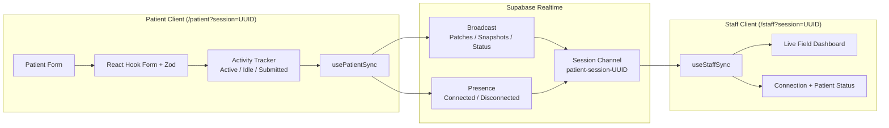
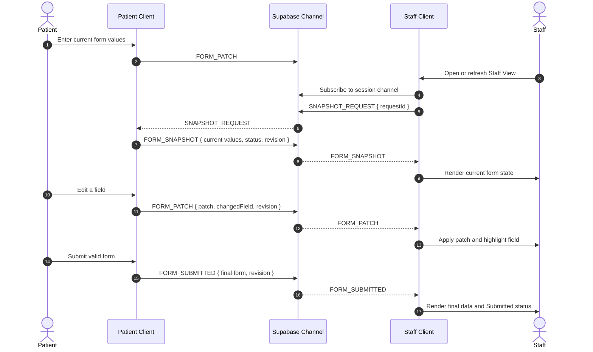

# System Architecture & Real-Time Data Flow

> **Project:** Agnos Health - Real-Time Patient Intake & Staff Monitoring System  
> **Document Version:** 2.0.0  
> **Target Cloud Host:** Vercel (Next.js application) + Supabase Realtime (Broadcast and Presence)  
> **Data Strategy:** Ephemeral demo data only; no browser or database persistence in the submission scope

---

## 1. High-Level Architecture

The application separates real-time form data from connection presence:

- **Broadcast events** carry form patches, snapshots, and patient lifecycle status.
- **Presence** reports whether the Patient client is connected or disconnected.
- **React state** holds the current form data in each connected browser.
- **No persistent storage** is used for draft or submitted patient data.



---

## 2. Session and Route Model

Each demonstration session uses a cryptographically random UUID. The landing page creates one session and presents two links:

```text
/patient?session=<uuid>
/staff?session=<uuid>
```

Both clients derive the same channel topic:

```text
patient-session-<uuid>
```

The application validates the session query parameter before joining a channel. A missing or invalid session ID shows an error and a link to create a new session.

This assignment uses a public Supabase channel with an unguessable UUID to minimize setup time. The deployed UI must state that it is a demo and that reviewers must not enter real patient information. A production implementation would add authentication, private channels, and Realtime Authorization policies.

---

## 3. State Model

Connection state and patient lifecycle state are separate concerns. This separation is an architectural choice, not a limitation of Supabase Presence.

Supabase Presence can synchronize an arbitrary small custom payload, so it is technically possible to publish `{ status: "actively_filling" }`, `{ status: "inactive" }`, or even `{ status: "submitted" }` through Presence. However, Presence does **not** detect browser focus, typing, idle time, or form submission by itself. The application must detect those conditions and then decide how to publish them.

```typescript
type ConnectionStatus = "connecting" | "connected" | "disconnected";

type PatientStatus =
  | "actively_filling"
  | "inactive"
  | "submitted";
```

### 3.1 Presence Responsibilities

In this project, Presence answers whether the Patient client is participating in the channel. The Patient tracks a small, slow-changing payload after the channel reaches `SUBSCRIBED`:

```typescript
{
  role: "patient";
  connectedAt: string;
}
```

- Presence `sync` or `join` with a Patient payload sets `connectionStatus` to `connected`.
- Presence `leave`, or a confirmed connection failure, sets `connectionStatus` to `disconnected`.
- If the Patient disconnects before submission, Staff displays the lifecycle state as `inactive` while preserving the last received form values.
- If the current lifecycle state is `submitted`, a later disconnect does not overwrite it.

Presence is not updated on every keystroke. Supabase describes Presence as appropriate for slow-changing shared state and warns that frequent `track()` calls can hit Presence rate limits; high-frequency or fire-and-forget updates should use Broadcast. See the [Supabase Presence guide](https://supabase.com/docs/guides/realtime/presence).

### 3.2 Patient Lifecycle Responsibilities

The application detects lifecycle transitions locally and sends them through Broadcast events:

- Input/focus handlers reset the idle timer and transition to `actively_filling`.
- Five seconds without activity, window blur, or `document.visibilityState === "hidden"` transitions to `inactive`.
- Successful Zod validation and form submission transitions to `submitted`.

`STATUS_CHANGED` is sent only when the state actually changes, rather than for every input event. Form values themselves use debounced `FORM_PATCH` events.

### 3.3 Why Lifecycle Does Not Use Presence

The choice is based on semantics and lifecycle behavior:

| Concern | Selected mechanism | Reason |
| --- | --- | --- |
| Patient joined or left the channel | Presence | Supabase provides `sync`, `join`, and `leave` reconciliation for connected clients. |
| Focus and idle detection | Browser events + idle timer | Supabase cannot infer UI focus or application-defined idle duration. |
| Active/inactive transition | Broadcast `STATUS_CHANGED` | It is application state and may change more frequently than Presence is intended to update. |
| Submitted status and final values | Broadcast `FORM_SUBMITTED` | Submission is a business event that must not disappear merely because the Patient Presence entry leaves the channel. |

Using Presence for `active` and `inactive` would still be technically valid if the application detected the states itself and called `track()` only on throttled transitions. It was not selected because it would mix connection metadata with business lifecycle state and would still require separate handling for a durable `submitted` result in the current Staff session.

The Staff UI displays connection health and patient lifecycle as separate labels so that, for example, a submitted Patient may also be disconnected.

---

## 4. Real-Time Event Protocol

Every payload contains a `sessionId` and monotonically increasing `revision`. Staff ignores events with a revision older than the latest applied revision.

### `FORM_PATCH`

Sent after a debounced field change.

```typescript
{
  sessionId: string;
  patch: Partial<PatientFormData>;
  changedField: keyof PatientFormData;
  revision: number;
  sentAt: string;
}
```

### `SNAPSHOT_REQUEST`

Sent by Staff immediately after subscribing or reconnecting.

```typescript
{
  sessionId: string;
  requestId: string;
  requestedAt: string;
}
```

### `FORM_SNAPSHOT`

Sent by the connected Patient in response to `SNAPSHOT_REQUEST`. This allows a late-joining or refreshed Staff View to recover current values without a database.

```typescript
{
  sessionId: string;
  requestId: string;
  formData: Partial<PatientFormData>;
  patientStatus: PatientStatus;
  revision: number;
  sentAt: string;
}
```

### `STATUS_CHANGED`

Sent only when the lifecycle state changes, not for every keystroke.

```typescript
{
  sessionId: string;
  patientStatus: PatientStatus;
  lastActivityAt: string;
  revision: number;
}
```

### `FORM_SUBMITTED`

Sent after successful validation. It includes the complete final form so that Staff cannot miss a pending debounced patch.

```typescript
{
  sessionId: string;
  formData: PatientFormData;
  patientStatus: "submitted";
  submittedAt: string;
  revision: number;
}
```

---

## 5. Late Join and Refresh Recovery

Client-to-client Broadcast is transient, so the Staff View actively requests the current state after every subscription.



If the Patient is not connected when Staff requests a snapshot, Staff retains any state already in memory and displays `Patient disconnected`. Because no persistent storage is in scope, refreshing both clients loses the session data; this limitation is documented in the README.

---

## 6. Component Architecture

```text
src/
├── app/
│   ├── layout.tsx
│   ├── page.tsx                    # Create session and show role links
│   ├── patient/page.tsx
│   └── staff/page.tsx
├── components/
│   ├── common/                     # Button, Input, Select, Badge, Card
│   ├── patient/
│   │   ├── patient-form.tsx
│   │   └── form-section.tsx
│   └── staff/
│       ├── staff-dashboard.tsx
│       ├── status-indicators.tsx
│       └── live-field-row.tsx
├── hooks/
│   ├── use-patient-sync.ts
│   ├── use-staff-sync.ts
│   └── use-idle-tracker.ts
├── lib/
│   ├── supabase.ts
│   ├── realtime-events.ts
│   ├── session.ts
│   ├── validations.ts
│   └── utils.ts
└── types/
    └── index.ts
```

The form subscription used for broadcasting should not force a root form re-render on every keystroke. Use a scoped React Hook Form subscription, and clean up debounced callbacks and Supabase channels on unmount.

---

## 7. Data Handling and Security Boundary

- Use only the Supabase publishable client key in browser code; never expose a secret or service-role key.
- Do not store form values in `localStorage`, `sessionStorage`, cookies, or a database for the required submission.
- Do not log form payloads in production.
- Show a visible demo-data warning on the Patient route.
- Use an unguessable session UUID and validate it before channel subscription.
- Document public-channel and non-persistence limitations in the README.
- Production hardening would require authentication, private channels, RLS policies, audit logging, encryption, and an explicit retention policy.
