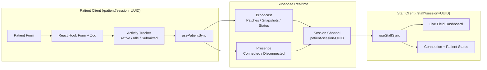
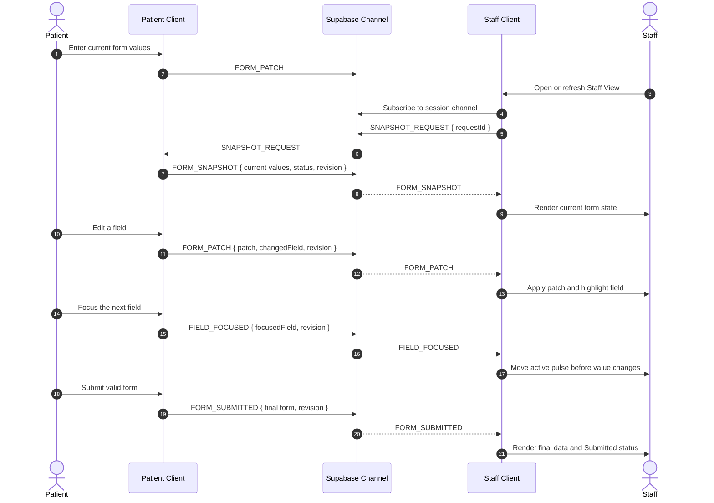

# System Architecture & Real-Time Data Flow

> **Project:** Agnos Health - Real-Time Patient Intake & Staff Monitoring System  
> **Document Version:** 2.1.0
> **Target Cloud Host:** Vercel (Next.js application) + Supabase Realtime (Broadcast and Presence)  
> **Data Strategy:** Ephemeral demo data only; no browser or database persistence in the submission scope

---

## 1. High-Level Architecture

The application separates real-time form data from connection presence:

- **Broadcast events** carry form patches, snapshots, and patient lifecycle status.
- **Presence** reports whether the Patient client is connected or disconnected.
- **React state** holds the current form data in each connected browser.
- **No persistent storage** is used for draft or submitted patient data.



---

## 2. Session and Route Model

Each demonstration session uses a cryptographically random UUID. Before a session
exists, the landing page presents one primary action: `Create new session`. After
that action creates the UUID, the same launcher surface reveals the two synchronized
role links:

```text
/patient?session=<uuid>
/staff?session=<uuid>
```

Both clients derive the same channel topic:

```text
patient-session-<uuid>
```

The application validates the session query parameter before joining a channel. A missing or invalid session ID shows an error and a link to create a new session.

This assignment uses a public Supabase channel with an unguessable UUID to minimize setup time. The deployed UI states `Demo only — Data is transmitted ephemerally and is not saved to a database or this browser.` A production implementation would add authentication, private channels, and Realtime Authorization policies.

---

## 3. State Model

Connection state and patient lifecycle state are separate concerns. This separation is an architectural choice, not a limitation of Supabase Presence.

Supabase Presence can synchronize an arbitrary small custom payload, so it is technically possible to publish `{ status: "actively_filling" }`, `{ status: "inactive" }`, or even `{ status: "submitted" }` through Presence. However, Presence does **not** detect browser focus, typing, idle time, or form submission by itself. The application must detect those conditions and then decide how to publish them.

```typescript
type ConnectionStatus = "connecting" | "connected" | "disconnected";

type PatientStatus =
  | "actively_filling"
  | "inactive"
  | "submitted";
```

### 3.1 Presence Responsibilities

In this project, Presence answers whether the Patient client is participating in the channel. The Patient tracks a small, slow-changing payload after the channel reaches `SUBSCRIBED`:

```typescript
{
  role: "patient";
  connectedAt: string;
}
```

- Presence `sync` or `join` with a Patient payload sets `connectionStatus` to `connected`.
- Presence `leave`, or a confirmed connection failure, sets `connectionStatus` to `disconnected`.
- If the Patient disconnects before submission, Staff displays the lifecycle state as `inactive` while preserving the last received form values.
- If the current lifecycle state is `submitted`, a later disconnect does not overwrite it.

Presence is not updated on every keystroke. Supabase describes Presence as appropriate for slow-changing shared state and warns that frequent `track()` calls can hit Presence rate limits; high-frequency or fire-and-forget updates should use Broadcast. See the [Supabase Presence guide](https://supabase.com/docs/guides/realtime/presence).

### 3.2 Patient Lifecycle Responsibilities

The application detects lifecycle transitions locally and sends them through Broadcast events:

- Input/focus handlers reset the idle timer and transition to `actively_filling`.
- Focus handlers also send `FIELD_FOCUSED` immediately with the exact control path, even when its value has not changed.
- Five seconds without activity, window blur, or `document.visibilityState === "hidden"` transitions to `inactive`.
- Successful Zod validation and form submission transitions to `submitted`.

`STATUS_CHANGED` is sent only when the state actually changes, rather than for every input event. Focus identity uses immediate `FIELD_FOCUSED` events, while form values use debounced `FORM_PATCH` events.

### 3.3 Why Lifecycle Does Not Use Presence

The choice is based on semantics and lifecycle behavior:

| Concern | Selected mechanism | Reason |
| --- | --- | --- |
| Patient joined or left the channel | Presence | Supabase provides `sync`, `join`, and `leave` reconciliation for connected clients. |
| Focus and idle detection | Browser events + idle timer | Supabase cannot infer UI focus or application-defined idle duration. |
| Current focused field | Broadcast `FIELD_FOCUSED` | Staff needs the control path immediately, before the Patient changes its value. |
| Active/inactive transition | Broadcast `STATUS_CHANGED` | It is application state and may change more frequently than Presence is intended to update. |
| Submitted status and final values | Broadcast `FORM_SUBMITTED` | Submission is a business event that must not disappear merely because the Patient Presence entry leaves the channel. |

Using Presence for `active` and `inactive` would still be technically valid if the application detected the states itself and called `track()` only on throttled transitions. It was not selected because it would mix connection metadata with business lifecycle state and would still require separate handling for a durable `submitted` result in the current Staff session.

The Staff UI displays connection health and patient lifecycle as separate labels so that, for example, a submitted Patient may also be disconnected.

---

## 4. Real-Time Event Protocol

Every payload contains a `sessionId` and monotonically increasing `revision`. Staff ignores events with a revision older than the latest applied revision.

### `FIELD_FOCUSED`

Sent immediately when Patient focus moves to a form control. Nested Emergency Contact controls use their exact React Hook Form paths.

```typescript
{
  sessionId: string;
  focusedField: PatientFormFieldPath;
  patientStatus: "actively_filling";
  lastActivityAt: string;
  revision: number;
}
```

### `FORM_PATCH`

Sent after a debounced field change.

```typescript
{
  sessionId: string;
  patch: Partial<PatientFormData>;
  changedField: keyof PatientFormData;
  focusedField: PatientFormFieldPath | null;
  patientStatus: "actively_filling" | "inactive";
  revision: number;
  sentAt: string;
}
```

### `SNAPSHOT_REQUEST`

Sent by Staff immediately after subscribing or reconnecting.

```typescript
{
  sessionId: string;
  requestId: string;
  requestedAt: string;
}
```

### `FORM_SNAPSHOT`

Sent by the connected Patient in response to `SNAPSHOT_REQUEST`. This allows a late-joining or refreshed Staff View to recover current values without a database.

```typescript
{
  sessionId: string;
  requestId: string;
  formData: Partial<PatientFormData>;
  focusedField: PatientFormFieldPath | null;
  patientStatus: PatientStatus;
  revision: number;
  sentAt: string;
}
```

### `STATUS_CHANGED`

Sent only when the lifecycle state changes, not for every keystroke.

```typescript
{
  sessionId: string;
  focusedField: PatientFormFieldPath | null;
  patientStatus: PatientStatus;
  lastActivityAt: string;
  revision: number;
}
```

### `FORM_SUBMITTED`

Sent after successful validation. It includes the complete final form so that Staff cannot miss a pending debounced patch.

```typescript
{
  sessionId: string;
  formData: PatientFormData;
  patientStatus: "submitted";
  submittedAt: string;
  revision: number;
}
```

---

## 5. Late Join and Refresh Recovery

Client-to-client Broadcast is transient, so the Staff View actively requests the current state after every subscription.



If the Patient is not connected when Staff requests a snapshot, Staff retains any state already in memory and displays `Patient disconnected`. Because no persistent storage is in scope, refreshing both clients loses the session data; this limitation is documented in the README.

---

## 6. Component Architecture

```text
src/
├── app/
│   ├── layout.tsx
│   ├── page.tsx                    # Render the single-action session launcher
│   ├── patient/page.tsx
│   └── staff/page.tsx
├── components/
│   ├── session-launcher.tsx        # Create one UUID, then reveal paired role links
│   ├── common/
│   │   ├── invalid-session.tsx
│   │   └── status-badge.tsx
│   ├── patient/
│   │   ├── patient-form.tsx
│   │   ├── patient-field-sync.tsx
│   │   ├── form-section.tsx
│   │   └── patient-vertical-slice.tsx  # Phase 1 compatibility adapter
│   └── staff/
│       └── staff-monitor.tsx           # Complete Phase 5 live dashboard
├── hooks/
│   ├── use-patient-sync.ts
│   ├── use-staff-sync.ts
│   ├── use-idle-tracker.ts
│   ├── use-patient-vertical-slice.ts
├── lib/
│   ├── supabase.ts
│   ├── realtime-events.ts
│   ├── session.ts
│   └── validations.ts
└── types/
    └── index.ts
```

The form subscription used for broadcasting should not force a root form re-render on every keystroke. Use a scoped React Hook Form subscription, and clean up debounced callbacks and Supabase channels on unmount.

### Phase 4 Implementation Status — Completed Locally August 29, 2026

The feature branch implements the complete Patient form with React Hook Form and
the shared Zod schema. Independent `useWatch` subscriptions broadcast all twelve
top-level `PatientFormData` fields without observing the entire form from its root.
The browser activity tracker transitions to `actively_filling` on interaction and
to `inactive` after five seconds, window blur, or a hidden document. Valid submit
events send the normalized final payload and lock the Patient UI in a visible
`Submission Confirmed` state. The Patient header shows connection health but does
not mirror the Staff-only active/inactive lifecycle indicators.

The landing page now uses one pre-session action instead of presenting Patient and
Staff as independent cards. After UUID creation, one shared result surface explains
that the Patient and Staff links are synchronized views of the same session.

Production remains on the Phase 3 v0.3.0 release until the Phase 4 branch passes
Preview review and the documented release workflow. The Supabase project currently
runs in `ap-northeast-2` (Seoul); this is accepted for the assignment demo because
P0 correctness and deployment take priority over regional latency optimization.

### Phase 5 Implementation Status — Completed Locally August 29, 2026

The Staff route now renders a responsive read-only dashboard backed directly by
`useStaffSync`. Connection Presence and Patient lifecycle status appear as
separate text-based cards. All Patient fields follow the Patient Form's three
section groups, untouched values are explicit, and the latest patched field uses
both an outline and a text label. Immediate focus events move an infinite,
reduced-motion-safe pulse/grow marker before typing begins; inactive or
disconnected sessions retain the same field as a static `Last active field`
highlight. Activity and submission timestamps are rendered when the protocol
provides them.

The synchronizer remains the only consumer of Realtime events. It preserves
revision/session guards and snapshot recovery, records patch timestamps as the
latest known activity, and locks submitted values against Presence leave and
later draft events. Component integration tests exercise those behaviors through
the existing hook rather than duplicating protocol logic in the UI.

---

## 7. Data Handling and Security Boundary

- Use only the Supabase publishable client key in browser code; never expose a secret or service-role key.
- Do not store form values in `localStorage`, `sessionStorage`, cookies, or a database for the required submission.
- Do not log form payloads in production.
- Show the visible ephemeral demo-data notice on the Landing and Patient routes.
- Use an unguessable session UUID and validate it before channel subscription.
- Document public-channel and non-persistence limitations in the README.
- Production hardening would require authentication, private channels, RLS policies, audit logging, encryption, and an explicit retention policy.
